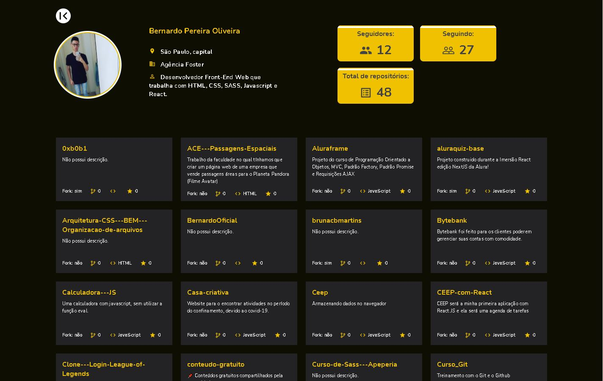

# Github Search

OBS: Essa projeto foi construido por mim, na minha conta conta antiga do Github que perdi o acesso dela, por isso, resolvi trazer o projeto para a conta que tenho acesso para realizar modificações.

Projeto original: [BernardoOficial/Github Search](https://github.com/BernardoOficial/Github-Search)

Acesse a aplicação e coloque seu username do github para visualizar seu perfil e repositórios de uma maneira criativa.

## Tecnologias utilizadas

- ReactJS
- React Router DOM
- Styled-components
- API Github
- MaterialUI Icons

## Resultado da busca do username:

## Projeto

Teste o projeto: [Acessar o Projeto](https://github-search-git-main-bernardooficial.vercel.app/).
